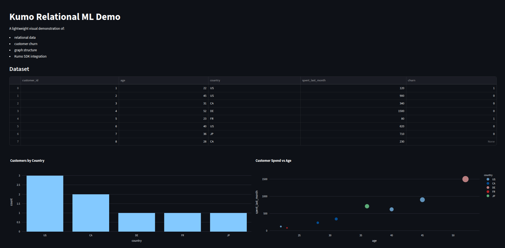
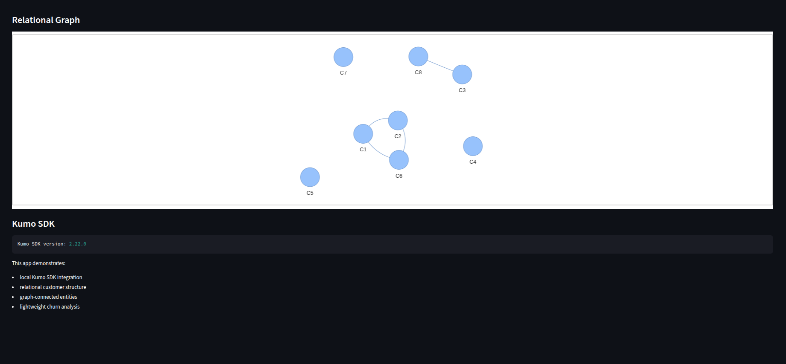

# kumo-simple-app

Multi-Table Relational Dataset Sandbox + KumoRFM Integration

## Screenshots

### Main Dashboard


### Relational Graph + Kumo Section


## Features
- Multi-table data (Customers, Orders, Products, Events)
- Real SQL joins for relational features
- Heterogeneous graph visualization
- Optional KumoRFM integration

## Quick Start
```bash
python3 -m venv venv
source venv/bin/activate
pip install -r requirements.txt
streamlit run dashboard.py
```

## Interactive KumoRFM Demo

Run the live demo with real KumoRFM API calls:

```bash
./setup_kumo_interactive_demo.sh
streamlit run kumo_rfm_live_demo.py


